# Task Management System for Claude Code

Production-ready task management system built on **Minion Engine v3.0** - a meta-cognitive AI reasoning framework that enforces systematic thinking, anti-hallucination safeguards, and reliability-labeled outputs.

## 📋 Overview

This system provides **intelligent task orchestration** for AI developer agents with:

- **85%+ token reduction** - Fractal architecture loads only what's needed
- **Universal compatibility** - Works with any language, framework, or project
- **Meta-cognitive reasoning** - Minion Engine v3.0 enforces systematic thinking
- **Zero-tolerance quality** - Mandatory TDD, fail-fast validation, no shortcuts
- **Reliability tracking** - Every claim labeled with confidence scores
- **Intelligent health monitoring** - Auto-detects and remediates stalled tasks

## 🏗️ System Architecture


## 🧠 Minion Engine v3.0 - The Foundation

*Credits to [u/og_hays on Reddit](https://www.reddit.com/r/PromptEngineering/comments/1o4kdko/been_awhile_friends_heres_my_latest_prompt_engine/) for coming up with the "Minion Engine"*

All agents operate within this meta-cognitive framework:

### Core Protocols

**12-Step Reasoning Chain** - Systematic problem-solving:

1. Intent Parsing → Understand what's being asked
2. Context Gathering → Load relevant data
3. Goal Definition → Define success criteria
4. System Mapping → Break into components
5. Knowledge Recall → Verify facts (never invent)
6. Design Hypothesis → Propose approaches
7. Simulation → Test mentally
8. Selection → Choose best approach
9. Construction → Build solution
10. Verification → Validate correctness
11. Optimization → Refine quality
12. Presentation → Deliver results

**Reliability Labeling Protocol** - All claims include confidence:

- 🟢95 [CONFIRMED] - Verified by running commands/reading source
- 🟡75 [CORROBORATED] - Multiple sources support this
- 🟢90 [OFFICIAL CLAIM] - From authoritative docs
- 🟡70 [REPORTED] - Single source or reasonable inference
- 🔵50 [SPECULATIVE] - Educated guess, needs verification

**Conditional Interview Protocol** - Asks clarifying questions when input is ambiguous rather than making assumptions.

**Anti-Hallucination Safeguards** - Never invents API signatures, config keys, or behavior. Always cites sources.

## 📂 Directory Structure

```
.tasks/
├── manifest.json              # Central index (~150 tokens)
├── metrics.json               # Performance tracking
├── tasks/                     # Individual task files (~600 tokens each)
│   ├── T001-setup.md
│   ├── T002-feature.md
│   └── T00X-*.md
├── completed/                 # Archived tasks with learnings
│   └── T001-setup.md
├── updates/                   # Atomic update records (concurrency-safe)
│   └── agent_<id>_<timestamp>.json
└── context/                   # Session-loaded context (~900 tokens)
    ├── project.md             # Vision, goals (~300 tokens)
    ├── architecture.md        # Tech stack, patterns (~300 tokens)
    ├── acceptance-templates.md  # Validation patterns (~200 tokens)
    └── test-scenarios/        # Test cases (~200 tokens each)
        └── *.feature
```

**Token Efficiency**: Status checks read only `manifest.json` (150 tokens). Full context loaded only when executing tasks (~1,650 tokens).

## 📟 Commands (7 Total)

### Initialization & Setup

#### `/task-init`

**Initialize task system in any project**

- Auto-discovers project type, documentation, validation tools
- Creates complete `.tasks/` structure with project-specific content
- Works with ANY project (Python, TypeScript, Rust, Go, Java, etc.)
- Uses Conditional Interview Protocol if project structure ambiguous
- **Agent**: `task-initializer` (Sonnet)

```bash
/task-init
# Discovers project → Extracts context → Generates tasks → Validates
```

#### `/task-add`

**Add new tasks incrementally**

- Comprehensive task generation matching initialization quality
- Analyzes dependencies against existing manifest
- Breaks large features into multiple tasks (>20k tokens → split)
- Creates atomic update records
- **Agent**: `task-creator` (Sonnet)

```bash
/task-add "implement email notifications with SendGrid"
/task-add path/to/requirement.md
```

### Task Discovery & Health

#### `/task-next`

**Two-phase: Health check THEN find next task**

**Phase 1: Health Check** (~150 tokens)

- Detects stalled tasks (>24h in progress)
- Identifies critical path blockages
- Finds priority misalignments
- If issues found → escalates to `task-manager` for remediation
- Circuit breaker prevents infinite remediation loops (max 3 attempts)

**Phase 2: Discovery** (~150 tokens)

- Fast query of manifest.json
- Filters: status=pending, dependencies met, not blocked
- Sorts by priority (1=highest)
- **Agent**: `task-discoverer` (Haiku - optimized for speed)

```bash
/task-next
# → T006: Email Notification System (Priority 2, ~10k tokens)
```

#### `/task-health`

**Standalone health check without task selection**

- Analyzes manifest for planning issues
- Reports on stalled tasks, bottlenecks, misalignments
- Optional deep analysis with `task-manager`
- Use before planning sprints or debugging slow progress

```bash
/task-health
# → Comprehensive diagnostic report
```

#### `/task-status`

**Comprehensive system overview**

- Reads manifest.json + metrics.json (~250 tokens)
- Shows stats, progress, bottlenecks, recent completions
- Adaptive output based on project size
- Error recovery for corrupted files

```bash
/task-status
# → Total: 10, Completed: 3 (30%), In Progress: 1, Pending: 5, Blocked: 1
```

### Execution & Completion

#### `/task-start [task-id]`

**Execute task with full context and TDD**

- Validates task availability (not in progress, dependencies met)
- Claims task atomically (concurrency-safe)
- Loads full context (~1,650 tokens)
- **Enforces mandatory TDD**: Tests BEFORE code, always
- Continuous validation after every logical unit
- Rigid 60+ item completion gate
- **Agent**: `task-executor` (Sonnet)

```bash
/task-start T006
# → Loads context → Plans → Implements with TDD → Validates continuously
```

**TDD Requirements:**

- Write failing test (must fail for right reason)
- Implement minimal code to pass
- Validate continuously (linter, tests, build)
- No code without corresponding tests
- Tests use realistic inputs, assert concrete outcomes

#### `/task-complete [task-id]`

**Zero-tolerance quality gate**

- Verifies ALL acceptance criteria checked (100%, not 90%)
- Executes ALL validation commands (fail-fast on first failure)
- Enforces Definition of Done checklist
- Binary outcome: Complete (100%) or Incomplete (0%)
- Extracts learnings (token usage, challenges, recommendations)
- Archives atomically, updates metrics
- **Agent**: `task-completer` (Sonnet)

```bash
/task-complete T006
# ✅ Success: All criteria met, all validations pass, archived
# ❌ Rejected: 2 criteria unchecked, fix and retry
```

**Quality Standards:**

- 0 linter errors, 0 warnings
- 100% test pass rate
- Build success with 0 warnings
- No TODO/FIXME/HACK comments
- Documentation updated
- Security reviewed

## 🤖 Specialized Agents (6 Total)


### task-initializer (Discovery & Setup)

**Model**: Sonnet | **Mode**: Creator

- Discovers project type, structure, documentation
- Works with ANY project (no perfect setup required)
- Extracts context into token-efficient files
- Generates comprehensive initial tasks
- Uses Conditional Interview Protocol if ambiguous
- Creates complete `.tasks/` structure

**Minion Engine Integration:**

- 12-Step Reasoning for discovery workflow
- Reliability Labeling on all discoveries
- Interview Protocol for unclear project structure
- Never assumes - always verifies file paths

### task-creator (Incremental Task Generation)

**Model**: Sonnet | **Mode**: Creator

- Creates tasks matching task-initializer quality
- Analyzes dependencies (verifies in manifest.json)
- Breaks large features into multiple tasks (>20k tokens)
- Prevents duplicates (checks existing tasks)
- Updates manifest atomically with dependency graph

**Minion Engine Integration:**

- Interview Protocol for vague feature descriptions
- Reliability Labeling on estimates and dependencies
- 6-Step Refinement Cycle for task quality
- Anti-hallucination: never guesses dependencies

### task-discoverer (Fast Queries)

**Model**: Haiku | **Mode**: Analyst

- Ultra-fast manifest queries (~150 tokens)
- Finds next actionable task in <1 second
- Minimal token output (speed over depth)
- Breadth over depth - no deep analysis

**Minion Engine Integration:**

- Simplified reasoning chain (optimized for speed)
- Reliability labels on all findings
- No interview protocol (fast agent)
- Returns immediately with confidence scores

### task-manager (Deep Analysis & Remediation)

**Model**: Sonnet | **Mode**: Analyst

- Fixes stalled tasks, critical path blockages
- Evidence-based root cause analysis
- **Executes remediation** (not just recommendations)
- Updates manifest, task files atomically
- Circuit breaker prevents infinite loops

**Minion Engine Integration:**

- Full 12-Step Reasoning for diagnosis
- Evidence-Based Analysis (cites task files, timestamps)
- Binary Decision Making (no "maybes")
- Every claim backed by evidence

### task-executor (TDD Implementation)

**Model**: Sonnet | **Mode**: Engineer

- **Mandatory TDD**: Tests BEFORE code, no exceptions
- Loads full context (~1,650 tokens)
- Iterates until evidence proves correctness
- Continuous validation after every step
- Never claims "works" without proof

**Minion Engine Integration:**

- Iterative Validation Loop (hypothesis → test → verify)
- Anti-Hallucination: never invents API signatures
- Reliability Labeling on all technical claims
- Interview Protocol for vague acceptance criteria

**Rigid 60+ Item Completion Gate:**

- ALL tests pass (100%, not 99%)
- ALL static analysis clean (0 errors, 0 warnings)
- Build succeeds with 0 warnings
- Code quality verified (no TODOs, no dead code)
- Evidence provided (attach command outputs)

### task-completer (Quality Gatekeeper)

**Model**: Sonnet | **Mode**: Verifier

- **Zero-tolerance validation**: 100% or 0%, no middle ground
- Fail-fast: stops at first failure
- Evidence required: attaches actual command outputs
- Binary outcome: Complete or Reject
- Extracts substantive learnings

**Minion Engine Integration:**

- Evidence-Based Claims (must attach outputs)
- Reliability Labeling mandatory for all assessments
- Fail-Fast Protocol (stop at first issue)
- Interview Protocol if evidence insufficient

**Philosophy**: *Premature completion is worse than no completion. It blocks dependent tasks with broken foundations.*

## 🔄 Task Lifecycle

```mermaid
stateDiagram-v2
    [*] --> pending: Created
    pending --> in_progress: /task-start
    in_progress --> completed: /task-complete ✅
    in_progress --> blocked: Blocker found
    in_progress --> pending: Remediation reset
    blocked --> pending: Blocker resolved
    completed --> [*]: Archived

    note right of in_progress
        TDD mandatory
        Continuous validation
        Progress logged
    end note

    note right of completed
        ALL criteria met
        ALL validations pass
        100% or rejected
    end note
```



## 🚀 Common Workflows

### Initialize New Project


### Execute Task with TDD

```mermaid
sequenceDiagram
    actor User
    participant Start as /task-start
    participant Exec as task-executor
    participant Tests as Test Suite
    participant Valid as Validation

    User->>Start: /task-start T006
    Start->>Exec: Delegate execution

    Exec->>Exec: Load context (1,650 tokens)
    Exec->>Exec: Claim task atomically

    loop For Each Feature
        Exec->>Tests: 1. Write failing test
        Tests-->>Exec: ❌ Fails (correct reason)

        Exec->>Exec: 2. Implement minimal code

        Exec->>Tests: 3. Run test
        Tests-->>Exec: ✅ Passes

        Exec->>Valid: 4. Validate (linter, build)
        Valid-->>Exec: ✅ Clean

        Exec->>Exec: 5. Check acceptance criterion
    end

    Exec->>Exec: Update progress log
    Exec-->>User: ✅ Ready for completion<br/>All criteria met<br/>All validations pass
```



### Health Check & Remediation


## 📊 Token Efficiency Analysis

### Traditional Monolithic Approach

```
Every status check loads:
- All task details: ~10,000 tokens
- All context: ~2,000 tokens
Total: ~12,000 tokens per check

With 10 checks per session: 120,000 tokens
```

### Fractal Task System (This System)

```
Status check (/task-status):
- manifest.json only: ~150 tokens

Task discovery (/task-next):
- manifest.json only: ~150 tokens
- Health check escalation: ~2,000 tokens (only when needed)

Starting task (/task-start):
- manifest.json: ~150 tokens
- Task file: ~600 tokens
- Context files: ~900 tokens
Total: ~1,650 tokens

With 10 status checks + 1 task start: 1,500 + 1,650 = 3,150 tokens
```

**Savings**: 120,000 → 3,150 = **97.4% reduction** 🎉

## 🛡️ Quality Guarantees

### Definition of Done Enforcement

Tasks are ONLY completed when:

- ✅ ALL acceptance criteria checked (100%)
- ✅ ALL validation commands pass (0 errors, 0 warnings)
- ✅ ALL tests passing (unit, integration, e2e)
- ✅ Build succeeds with 0 warnings
- ✅ Linting: 0 errors, 0 warnings
- ✅ No TODO/FIXME comments remain
- ✅ Documentation updated
- ✅ Learnings documented
- ✅ Security reviewed

**No shortcuts. No exceptions. Binary outcome: 100% or 0%.**

### Validation Command Auto-Discovery

System auto-discovers validation for:

**Python**: pytest, ruff, pylint, black, mypy, pyright
**TypeScript/JavaScript**: npm test, vitest, jest, eslint, prettier, tsc
**Rust**: cargo test, cargo clippy, cargo fmt, cargo build
**Go**: go test, golangci-lint, gofmt, go build
**C#**: dotnet test, dotnet build
**Java**: mvn test, gradle test, checkstyle

### Agent Whitelist Enforcement

Each command only allows specific agents to execute:

- **Prevents**: Wrong agent from global `~/.claude/agents/` running
- **Ensures**: Only workflow-specific agents with correct standards execute
- **Example**: `/task-complete` ONLY allows `task-completer`, not any generic agent

This prevents dilution of quality standards.

## 📈 Key Design Principles

### 1. Project Agnostic

- Zero hardcoded details about languages/frameworks
- Discovery-based approach finds everything automatically
- Works immediately with ANY project

### 2. Token Efficient

- Lazy loading: Load only what's needed when needed
- Manifest as index: 150-token file for all status checks
- Context reuse: Load project context once per session

### 3. Quality First

- Zero tolerance for incomplete work
- Validation-driven development (TDD mandatory)
- Definition of Done enforced rigorously
- Premature completion blocked (worse than no completion)

### 4. Concurrent Safe

- Atomic updates via update files
- Reconciliation handles concurrent operations
- No race conditions in multi-agent scenarios

### 5. Observable

- Comprehensive metrics (token usage, duration, velocity)
- Progress tracking (completion %, bottlenecks)
- Audit trail (all changes logged with timestamps)
- Reliability scores on all claims

### 6. Meta-Cognitive

- Systematic 12-step reasoning chain
- Reliability labeling on all assessments
- Interview protocol prevents assumptions
- Anti-hallucination safeguards enforce truth

## 🚀 Getting Started

### 1. Copy System to Your Project

```bash
# From this repository
cp -r .claude/commands/task-*.md your-project/.claude/commands/
cp -r .claude/agents/task-*.md your-project/.claude/agents/
cp .claude/core/minion-engine.md your-project/.claude/core/
```

### 2. Initialize Task System

```bash
cd your-project
/task-init
```

This will:

- Discover your project structure
- Find documentation (or create basic structure)
- Detect testing framework and validation tools
- Generate initial tasks from requirements
- Create complete `.tasks/` directory

### 3. Check Status

```bash
/task-status
```

### 4. Start Working

```bash
# Find next task
/task-next

# Start specific task
/task-start T001

# When complete
/task-complete T001
```

## 📊 Typical Workflows

### Solo Developer

```bash
# Initialize (once)
/task-init

# Daily workflow
/task-status              # Check overall status
/task-next                # Find next task
/task-start T001          # Start task (loads full context)
# ... implement with TDD ...
/task-complete T001       # Validate and archive
```

### Team / Multiple Agents

```bash
# Agent 1
/task-next                # Get T001
/task-start T001          # Claim it (atomic)
# ... working on T001 ...

# Agent 2 (concurrent)
/task-next                # Get T002 (different task)
/task-start T002          # Claim it (atomic)
# ... working on T002 ...

# Both complete
/task-complete T001       # Agent 1 finishes
/task-complete T002       # Agent 2 finishes
```

Concurrency is safe via atomic update files in `.tasks/updates/`.

## 🐛 Troubleshooting

### "Task system not initialized"

**Solution**: Run `/task-init`

### "No actionable tasks"

**Cause**: All pending tasks have incomplete dependencies or blockers
**Solution**: Check `/task-status` for bottlenecks, `/task-health` for deep analysis

### "Validation failed"

**Cause**: Code doesn't meet quality standards
**Solution**: Fix issues reported, re-run validation, retry completion

### "Circuit Breaker: Remediation Loop Detected"

**Cause**: Task system remediation failed 3+ times
**Solution**:

1. Review `.tasks/updates/` for remediation history
2. Run `/task-health` for diagnostics
3. Manual manifest correction if needed
4. Reset: Edit `manifest.json` → `config.remediation_attempts = 0`

### Stats don't match reality

**Cause**: Manual edits or system inconsistency
**Solution**: Run `/task-health` for comprehensive diagnosis and remediation

## 🎓 Advanced Features

### Circuit Breaker Pattern

Prevents infinite remediation loops:

- Tracks remediation attempts in manifest.json
- Max 3 attempts per issue
- If exceeded → reports failure, requires manual intervention
- Reset via `config.remediation_attempts = 0`

### Reliability Labeling

All agents label their claims with confidence:

- Enables risk assessment
- Provides transparency in reasoning
- Allows users to evaluate trustworthiness
- Creates audit trail for decisions

### Conditional Interview Protocol

Agents ask clarifying questions instead of guessing:

- Triggered on ambiguous input
- Targeted, specific questions
- Confirms understanding before proceeding
- Reduces wasted work from wrong assumptions

### Evidence-Based Analysis

Every diagnostic claim must cite evidence:

- File paths with line numbers
- Command outputs with timestamps
- Progress log quotes
- No speculation without labeling

## 📚 Documentation Structure

```
.claude/
├── commands/           # 7 slash commands
│   ├── task-init.md
│   ├── task-add.md
│   ├── task-next.md
│   ├── task-start.md
│   ├── task-complete.md
│   ├── task-status.md
│   └── task-health.md
├── agents/            # 6 specialized agents
│   ├── task-manager.md
│   ├── task-initializer.md
│   ├── task-creator.md
│   ├── task-executor.md
│   ├── task-completer.md
│   ├── task-discoverer.md
│   └── examples/      # Example files
└── core/
    └── minion-engine.md   # Foundational framework
```

## 🔗 Integration Points

### Claude Code Settings

Configure in `.claude/settings.json`:

```json
{
  "taskManagement": {
    "tokenBudgets": {
      "manifestLoad": 150,
      "taskFileLoad": 600,
      "contextLoad": 900,
      "fullTaskLoad": 1650
    },
    "validation": {
      "requireAllCriteriaChecked": true,
      "requireValidationCommandsPass": true,
      "allowPartialCompletion": false,
      "enforceDefinitionOfDone": true
    },
    "remediation": {
      "maxAttempts": 3,
      "stalledThresholdHours": 24
    }
  }
}
```

### Hooks (Optional)

Can add validation hooks for task file modifications:

- `preToolUse`: Validate before changes
- `postToolUse`: Maintain consistency after changes
- `userPromptSubmit`: Suggest initialization if missing

## 📊 Success Metrics

Track these to measure system effectiveness:

**Token Efficiency**

- Target: >85% reduction vs monolithic
- Measure: Average tokens per task vs 12,000 baseline

**Estimate Accuracy**

- Target: ±20% variance
- Measure: Actual tokens vs estimated tokens

**Completion Velocity**

- Track: Tasks completed per day
- Trend: Should increase as team learns system

**Quality Score**

- Track: % of tasks passing validation first time
- Target: >80% pass rate

**Bottleneck Resolution**

- Track: Average time task spends blocked
- Target: <24 hours

## ⚡ Performance Characteristics

- **Initialization**: ~500-1,000 tokens (one-time)
- **Status Check**: ~150 tokens
- **Task Discovery**: ~150 tokens (healthy), ~2,000 (remediation)
- **Task Execution**: ~1,650 tokens startup, variable implementation
- **Task Completion**: ~2,350 tokens (load + validation + archival)

**Compare to monolithic**: 12,000+ tokens for every operation.

## 🎯 What Makes This Different

1. **Minion Engine v3.0** - Meta-cognitive framework enforces systematic thinking
2. **Reliability Labeling** - Every claim has confidence score
3. **Zero-Tolerance Quality** - Binary completion: 100% or 0%
4. **Mandatory TDD** - No code without tests, ever
5. **Agent Specialization** - 6 focused agents, each expert in their domain
6. **Health Monitoring** - Auto-detects and fixes stalled tasks
7. **Evidence-Based** - Every diagnostic claim cited with source
8. **Interview Protocol** - Asks questions instead of guessing
9. **Token Efficient** - 97%+ reduction, load only what's needed
10. **Universal** - Works with any project, any language

---

**Framework**: Built on Minion Engine v3.0
**License**: MIT
**Status**: Production-Ready
**Last Updated**: 2025-10-13
